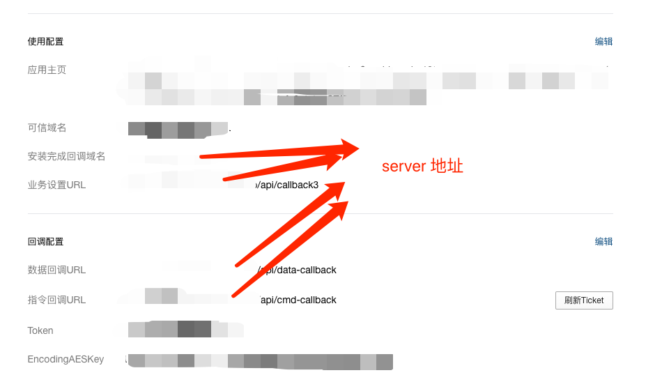
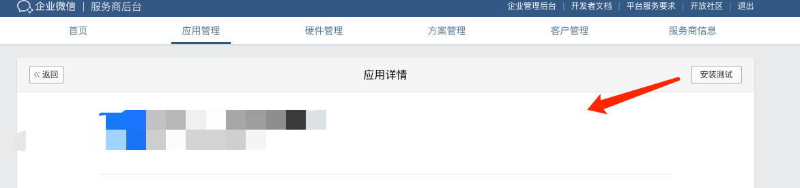

# 企业微信第三方应用 Demo

技术栈: cra(前端) + next.js(后端)


## 如何运行


0. 根目录 `yarn bootstrap ` 安装依赖
1. 在 server 项目下面新增.env 文件

```


#  这些信息来自 [服务商应用管理](https://open.work.weixin.qq.com/wwopen/developer/#/sass/apps/list)

SUITE_ID=XXX
SECRET=XXX
TOKEN=XXX
ENCODING_AES_KEY=XXX

# This text is inserted by `prisma init`:
# Environment variables declared in this file are automatically made available to Prisma.
# See the documentation for more detail: https://pris.ly/d/prisma-schema#using-environment-variables

# Prisma supports the native connection string format for PostgreSQL, MySQL and SQLite.
# See the documentation for all the connection string options: https://pris.ly/d/connection-strings

DATABASE_URL="file:./dev.db"

```

2. 启动内网代理工具. 我用的是 ngrok 免费版. 相关命令为: `ngrok http 3000`. 得到一个外网的 https server 地址.
3. 在 server 目录跑一遍
3. 在 client 项目下面新增 .env 文件

```
# REACT_APP_SERVER_HOST 的值来自 步骤 2 的 https server 地址
REACT_APP_SERVER_HOST=xxx

# 以下参数用来把打包后的 cra 项目发到 aws 上面. 用阿里云或者其他的的可以自行项目的 deploy 流程
AWS_BUCKET=xxx
AWS_ACCESS_KEY_ID=xxx
AWS_SECRET_ACCESS_KEY=xxx
AWS_REGION=cn-northwest-1
AWS_PATH=wechat-homework-demo
```
4. cd 到 client 目录.执行 yarn build && yarn deploy 将前端项目发到 s3.
5. 进入服务商后台的 demo 应用详情里面.替换着几个地址的 host 为步骤 2 的地址.



5 步骤后 server 会收到企业微信的 `data-callback` 和 `cmd-callback` 回调.

6. demo 的跳转是前端做的.所以 应用主页类似于: https://open.weixin.qq.com/connect/oauth2/authorize?appid=XXX&redirect_uri=https%3A%2F%2FXXX%2Fwechat-homework-demo%2F%23%2F%3FcorpId%3D$CORPID$&response_type=code&scope=snsapi_userinfo&state=STATE#wechat_redirect

将上面 xxx 换成你自己的.

7. 新增一个企业微信小号.让他测试


